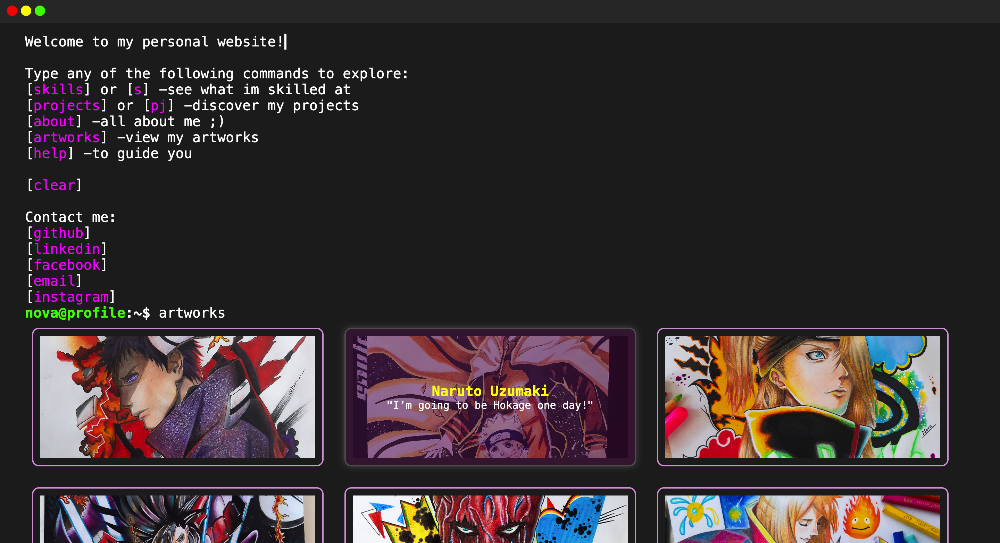

# Terminal Themed Portfolio (a fun project I made)

Welcome to my interactive portfolio website! This project presents a unique terminal-style interface where users can explore my skills, projects, and personal information through command-line commands.

## Table of Contents
- [Features](#features)
- [Technologies Used](#technologies-used)
- [Commands](#commands)

## Features
- Interactive terminal interface for a modern portfolio experience.
- Easy navigation through simple command inputs.
- Links to social media and project repositories.
- Responsive design to ensure usability across devices.

## Technologies Used
- HTML
- CSS
- JavaScript

## Commands
Here are some of the commands you can use:

- **`help`**: List available commands and their functions.
- **`skills`** or **`s`**: View a detailed list of my skills.
- **`projects`** or **`pj`**: Discover my projects and their details.
- **`about`**: Learn more about me and my background.
- **`clear`** or **`c`**: Clear the terminal output.
- **`github`** or **`gh`**: Redirect to my GitHub profile.
- **`linkedin`** or **`lk`**: Redirect to my LinkedIn profile.
- **`facebook`** or **`fb`**: Redirect to my Facebook profile.
- **`email`** or **`em`**: Open your email client to send me a message.
- **`instagram`** or **`st`**: Redirect to my Instagram profile.
## Screenshot

